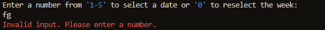
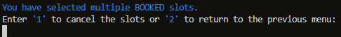
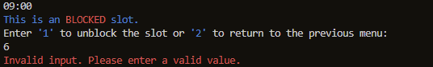

# Appointment Scheduling System (Prototype)

## Introduction

This application is part of a future full-stack solution designed for a real IT support consultant. The consultant currently manages bookings through emails and phone calls, which leads to various issues, such as last-minute cancellations and difficulty in keeping track of booking times due to frequent changes.

The purpose of this application is to enable the client to efficiently handle and plan their bookings in advance. While the current version lacks detailed information for each booking, a future iteration envisions a robust full-stack solution that will revolutionise the way the IT support consultant manages their business operations.

In these upcoming iterations, the application aims to integrate a multitude of features to enhance both the consultant's workflow and the overall client experience. Some of the key enhancements include:

**Automated Reminders:** To reduce the occurrence of last-minute cancellations and no-shows, the system will implement automated appointment reminders. These reminders will be sent to the clients via email and text to mobiles, ensuring that they are well-informed about upcoming scheduled appointments.

**A comprehensive Database:** The future iteration will include a SQL database system to store and organise all booking details. This database will not only provide permanent access to booking records but also record service history as well as appointment details, allowing the consultant to track past services, issues resolved, and recommended follow-up actions.

**A website:** A user-friendly website will be developed to allow clients to register, log in, and book appointment requests online. Clients can conveniently browse the consultant's availability, select suitable time slots, and submit their appointment requests, improving accessibility and convenience for clients.

**A deposit System:** To mitigate last-minute cancellations and ensure commitment from clients, the application will introduce a deposit system. Clients may be required to make a deposit when booking appointments, which can be refunded or applied towards the service fee upon completion of the appointment.

**Excel spreadsheets:** Used instead of Google Sheets due to the ease of adding appointment notes. Adding notes to booked appointments is crucial, and Excel allows this to be achieved this seamlessly through Python scripting whereas gspread does not support this.

These planned enhancements will transform the application into a comprehensive, end-to-end solution that not only addresses the consultant's current challenges but also takes their business to the next level of efficiency and customer service. By providing a seamless, integrated platform for appointment management, billing, communication, and client engagement, the consultant can focus more on delivering top-notch IT support while leaving the administrative tasks to the application.

You can access the application [here](https://appointment-booking-system-987e0f827702.herokuapp.com/). <br>
You can also access the associated spreadsheet [here](https://docs.google.com/spreadsheets/d/1uBX51j8qVqieYV65oMwpC26L3HZVyuoybPL4kNRlyxY/edit?usp=sharing).

***IMPORTANT NOTE: The login credentials are 'admin' for the username and 'password' for the password.***

## How to use the application

* The user is asked whether they would like to login (typing 'n' exits the application)
* A login consists of a username and password and these need to be typed correctly in order to log in (details provided above).
* After logging in, the program detects the time and date of log in, where each week starts on a Monday at 12:00 AM, and automatically updates the spreadsheet for week1 to match the current week and all the following weeks are shifted along accordingly. Previous weeks are deleted because they are no longer relevant and new weeks with open slots are appended to the end of the spreadsheet. If the user logs in within the current week, no update takes place. In a future iteration of this application, the deleted weeks will be archived in a database for reference.
* After this, the user is presented with a set of weeks from 1-12 with numbers allocated to each ("week1" represents the current week) and an option to exit the application.
* After selecting an appropriate week, the user is then presented with the days of that week with numbers allocated to each day. There is also an option to return to the week selection in case of a mistake.
* After selecting a day, the user is then presented the time slots for the selected day and whether the time slots are booked, blocked or open according to the spreadsheet. The user now has the option to either exit the program altogether, to cancel the choice which allows the user to reselect a day, to select a specific time slot or to select a range of time slots. Selecting a single time slot allows the alteration that single slot only, whereas selecting multiple slots allows multiple slots to be changed.
* If the user selects an open slot, or multiple open slots, they have the choice to book these slots, block these slots or to cancel their choice and return to the previous menu to select different slots. Booking a time slot or range, automatically puts a block at the start and end of the bookings so that appointments are not booked back to back and the consultant has time to travel to the appointment destination.
* If the user selects a booked slot or multiple booked slots, they have the option of either cancelling them all or returning to the previous menu.
* If the user selects a blocked slot or multiple blocked slots, they have the option of either unblocking them all or returning to the previous menu.
* If the user selects a mixture of open and blocked slots, they have the option of either blocking all the open slots, unblocking the blocked slots or returning to the previous menu.
* If the user selects a mixture of open and booked slots, they have the option of either booking all the open slots, cancelling the booked slots or returning to the previous menu.
* If the user selects a mixture of blocked and booked slots, since booked appointments cannot be blocked and blocked slots cannot be booked the user has only 2 options: cancel all appointments and unblock all slots or return to the previous menu.
* If the user selects a mixture of blocked, booked and open slots, the same logic as above applies where the user has only 2 options: cancel all appointments and unblock all slots or return to the previous menu.
* For each change of slot, there is a confirmation which if not confirmed, does not change the slot and reprompts the user for the appropriate action.
* If the user confirms, the program then adjusts the spreadsheet accordingly.
* When a slot has been changed, the user is prompted as to whether they would like to schedule more appointments. If yes, the program loops to the day select again. If no, the program exits.

**Please note: Although these instructions might appear complex, the application is actually straightforward and user-friendly.**

## User stories

As a user I want to:

* Have a secure system which only I can access so that I can manage my weekly work schedule.
* View my current schedule for any specific day.
* Select a week, day and time to book an appointment.
* Ensure that my bookings are not booked back-to-back so that I have time to plan my journey and travel to my next customer.
* There to be safety measures so that I do not accidentally book slots where I am unavailable and similarly do not block slots where there are booked appointments
* Block slots for times on days where I am busy with other endeavours and unblock slots when necessary.
* Cancel appointments that are no longer required.
* Manage multiple slots to book long sessions, block entire days or cancel multiple appointments and slots.
* Navigate the system with ease and have feedback for every decision that I make.
* Cancel my decision if I make any mistakes at any point while I am using the application.

## Logic flow

While booking appointments on various applications may appear straightforward, there are numerous user-customisable options that can significantly impact the overall user experience. To streamline the intricate logic behind the process, Lucidchart was used to create a comprehensive flow diagram. This diagram helps to visualise all available options within the application, define how different components should interact with each other, and provides a detailed understanding of the application mechanics.

The initial flow chart was developed before the project's actual implementation, and consequently, it does not encompass all the elements that were eventually included in the final system. Many features that initially seemed practical in the flow chart were either removed or expanded upon during development. As a result, the final flow chart would be significantly more complex, as it has to account for many more different user options when selecting a time slot. <br>

 <br>

## Features

* Throughout this application:
		* Blue text represents key information and is also used for 'BOOKED' slots.
		* Yellow text represents a process taking place.
		* Green text represents a successful process and is also used for 'OPEN' slots.
		* Red text represents a failed process and is also used for 'BLOCKED' slots.
* When the application is run, the user is presented with a simple introduction and asked whether they would like to log in: <br>
		
 <br>

* Whenever the user exits the application they will see a message: <br>
		
 <br>
		
* If the user types 'y' then they are presented with a login menu where the user would need to enter the correct details in order to log in. The input fields purposely do not display the user input as a security measure: <br>
		
 <br>
		
* Neither the username nor the password fields can be left empty: <br>
		
 <br>
 <br>
		
* If the credentials are incorrect the login fails: <br>
		
 <br>
		
* The user is asked to try again after a failed login but has a maximum of 3 attempts. When the login fails 3 times the user is temporarily locked out: <br>
		
 <br>
		
* If the user enters the correct details, a login will be successful. The system will then check the date and time of login and then access the worksheet, select the "week1" tab select the cell "A2" (which is Monday). These 2 values will be compared and the difference in days will be calculated as follows: <br>


  * If the number of days is less than 7, no updates are made to the spreadsheets: <br>

   <br>

  * When the number of days exceeds 7, the system updates the spreadsheets based on the formula: difference_in_weeks = (monday_date - cell_date).days // 7. Using the difference_in_weeks variable, the spreadsheets are updated as follows: for example, if difference_in_weeks is 3, 'week4' will overwrite 'week1,' 'week5' will overwrite 'week2,' and so on. This process affects all tabs on the spreadsheet. For the last 3 weeks, dates are generated and inserted into cells (A2:A6), and all appointment slots are overwritten with 'OPEN' to indicate newly available slots. The system maintains consistency by ensuring that the 'week1' tab on the spreadsheet represents the current week at the time of login, following Python's convention where weeks start on Mondays at 12:00 AM.

  * If the 'difference_in_weeks' variable is 12 or greater, all tabs are updated to reflect the correct dates, and all appointment slots are set to 'OPEN'.
 
* After this process, the user is immediately presented with a set of weeks to choose from: <br>

 <br>

* If the user enters an invalid value, the user gets an error message: <br>

 <br>

* If the user enters a value that is out of range of the menu they receive a different error message: <br>

 <br>

* At this stage the user also has the option of exiting the program by typing '0'.
* If the user enters a valid input then they will be presented with the days of that particular week: <br>

 <br>

* If the user inputs an invalid entry they get an error message: <br>

 <br>

* If the user inputs a vale that is not in range they get an error message: <br>

 <br>

* At this stage, the user is able to return to the previous menu to reselect a week by typing '0' in case a mistake is made.
* If a valid number is entered the user is then presented with a menu to choose either a single slot or a range of slots: <br>

 <br>

* The time input must be in the correct format and within the given range. If it is not, the user gets an error message: <br>

 <br>

* At this stage the user can exit the program by typing 'exit' or can return to the previous menu to select a different day by typing 'cancel'.
* If the user inputs a valid value then another menu is presented to the user depending on the state of the selected slot or range of slots:
  * If a single 'BOOKED' slot is selected the user can cancel the appointment or return to the previous menu: <br>
  
   <br>
  
  * If a single 'OPEN' slot is selected the user can book an appointment, block the slot or return to the previous menu: <br>
  
   <br>
  
  * If a single 'BLOCKED' slot is selected the user can unblock the slot or return to the previous menu: <br>

   <br>
  
  * If a multiple 'BOOKED' slots are selected the user can cancel all appointments or return to the previous menu: <br>
  
   <br>
  
  * If a multiple 'OPEN' slots are selected the user can book all slots, block all slots or return to the previous menu: <br>
  
   <br>
  
  * If a multiple 'BLOCKED' slots are selected the user can unblock all slots or return to the previous menu: <br>
  
   <br>
  
  * If a mixture of 'BOOKED' and 'OPEN' slots are selected the user can book all the open slots, cancel all the booked slots or return to the previous menu: <br>
  
   <br>
  
  * If a mixture of 'BLOCKED' and 'OPEN' slots are selected the user can block all the open slots, unblock all the blocked slots or return to the previous menu: <br>
  
   <br>
  
  * If a mixture of 'BOOKED' and 'BLOCKED' slots are selected the user can open all the remaining slots (cancels all appointments and unblocks all blocked slots) or return to the previous menu: <br>
  
   <br>
  
  * If a mixture of 'OPEN', 'BOOKED' and 'BLOCKED' slots are selected the user can open all the remaining slots (cancels all appointments and unblocks all blocked slots) or return to the previous menu: <br>
  
   <br>
  
* In the next menu after selecting a slot or range of slots, any invalid inputs give an error message to the user: <br>

 <br>

* Returning to the previous menu will allow the user to pick a different slot or range of slots in case a mistake is made: <br>

 <br>

* If the user selects an option which involves altering a slot they will receive a message to confirm the change in case the user makes a mistake. If the user does not confirm the action then no change takes place and they are returned to the slot action menu for the slots that they have selected. However, if the user confirms the change then the system alters the slot or slots and notifies the user: <br>

 <br>

* The user is then prompted as to whether they would like to schedule more slots ot not. If the user decides not to, then the programs exits. If the user agrees to schedule more then the user is presented with the time slots for the day that was initially selected and can therefore adjust more slots if required.

*  Future features have been thoroughly discussed in the introduction of this document.

## Technologies used

### Languages used

* Python

### Programs used

* [Github](https://github.com/) used for version control.
* [Lucidchart](https://www.lucidchart.com/) used for the flow diagram.
* [Heroku](https://www.heroku.com/) used to deploy the application.

### Python libraries

* gspread: This is a Python library for interacting with Google Sheets API.
* google.oauth2.service_account: This is part of the Google Auth library and is used for authenticating the application with Google services using a service account.
* getpass: This is a Python library used for securely reading passwords and sensitive information from the command line.
* colorama: A Python library that allows colored output to the console.
* datetime: A Python library for working with dates and times.
* time: A Python library for time-related functions.
* os: A Python library for interacting with the operating system.
* env.py: Used to store configuration or secret information. This is a common practice for keeping sensitive data separate from the code.

## Testing

### Validator testing

[Python validator](https://pep8ci.herokuapp.com/#)

### Testing User Stories

* As a user I want to have a secure system which only I can access so that I can manage my weekly work schedule.
  * The system has a secure login which hides the input credentials when logging in and temporarily stops the user if 3 login attempts fail consecutively: <br>

   <br>
  
* As a user I want to view my current schedule for any specific day.
  * After logging in, the user is able to select a week and then a day. The daily schedule is then presented to the user: <br>

   <br>
  
* As a user I want to select a week, day and time to book an appointment.
  * When a slot is selected, it can then be adjusted depending on the user input.
* As a user I want to ensure that my bookings are not booked back-to-back so that I have time to plan my journey and travel to my next customer.
  * Whenever an appointment is booked, in order to prevent back-to-back bookings the slots immediately before and after the booked slot will be blocked.
  * This applies to ranged slot bookings too.
* As a user I want there to be safety measures so that I do not accidentally book slots where I am unavailable and similarly do not block slots where there are booked appointments.
  * Where there booked appointment slots, the slots cannot be blocked because of the booking (the appointment must be cancelled first). This is to prevent booked appointments from being accidentally removed.
  * Where there are blocked slots, bookings cannot be made because of the block (the block must be removed first). This is to prevent blocked appointments from being booked since a block is supposed to represent unavailability of the consultant.
* As a user I want to block slots for times on days where I am busy with other endeavours and unblock slots when necessary.
  * Booked appointment slots must be cancelled first to make them open slots.
  * With any open slots, the user can select as many as they would like in a selected day as long as the slots are consecutive, and block them all.
* As a user I want to cancel appointments that are no longer required.
  * Booked slots can be selected and changed to open slots.
  * Multiple booked and blocked slots can be selected together to be opened.
* As a user I want to manage multiple slots to book long sessions, block entire days or cancel multiple appointments and slots.
  * A range of times can be selected for the desired operation between 09:00 and 16:30 in the day and changed as necessary.
* As a user I want to navigate the system with ease and have feedback for every decision that I make.
  * For every step of the way, there is information text in blue to give instructions of the options available.
  * Whenever the system is processing information, there is feedback provided in yellow.
  * When a process is successful, feedback is provided in green.
  * When a process fails as a result of an invalid input, feedback is provided in red.
* As a user I want to cancel my decision if I make any mistakes at any point while I am using the application.
  * For every step, there is an option to return to the previous menu in a case a mistake is made.
 
### Input testing

All user inputs were tested thoroughly to ensure all input data is handled correctly and appropriate feedback is given to the user as follows:

* The initial login prompt only accepts 'y' or 'n' as inputs where 'n' exits the program and 'y' initiates the next step. It has been tested with invalid inputs and correctly gives feedback to the user.
* Both the username and password cannot be left blank and accept any values as inputs. The program correctly gives feedback if either of these fields are left empty.
* Without the correct login details, the login fails and the correct feedback is provided to the user upon failing. 3 failed attempts locks out the user and also provides the correct feedback.
* Upon successfully logging in, the user is provided with feedback and the dates are updated as required. To test this manually I created a function to manually set the dates:

```python
def fix_cell_dates():
    """
    This function is entirely for testing purposes. 
    The dates of the spreadsheet can be set manually.
    """
    
    print(Fore.YELLOW + 'Setting dates...')
    worksheet_names = [ "week1", "week2", "week3", "week4", "week5", "week6", "week7", "week8", "week9", "week10", "week11", "week12" ]
    current_datetime = datetime.datetime.now()
    
    for i, worksheet_name in enumerate(worksheet_names):
        worksheet = SHEET.worksheet(worksheet_name)

        days_since_monday = (current_datetime.weekday() - 0) % 7
        start_date = current_datetime - datetime.timedelta(days=days_since_monday) - datetime.timedelta(weeks=2) + datetime.timedelta(weeks=i) # weeks can be changed to set the week difference

        dates = [start_date + datetime.timedelta(days=j) for j in range(5)]

        formatted_dates = [f"{date.strftime('%A')} ({date.strftime('%d-%m-%Y')})" for date in dates]

        cell_values = worksheet.range("A2:A6")

        for j, date in enumerate(formatted_dates):
            cell_values[j].value = date

        worksheet.update_cells(cell_values)

fix_cell_dates()
```

* When selecting a week, the user must enter a correct value as provided by the list. If any invalid value is inserted an error message is correctly displayed to the user. From here the user can exit the program here which works correctly.
* When selecting a day, the user must enter a value from '0-6' where '0' returns to the previous menu. If any invalid value is entered here, the user gets an error message.
* When selecting a time input the value must be in th correct format and within the correct time range otherwise the user gets an error message. From here the user can exit the program or return to the previous menu, both of which work given the appropriate input.
* When altering a slot, the input must be a value from the menu presented or else the user will get an error message. This has been tested for every use case.
* The confirmation for changing a slot only accepts a 'y' or 'n' value where 'n' returns to the previous menu and 'y' actions the change. Any other input values give the user an error message.
* Confirming the change works correctly and has been tested in every use case.
* Finally, the last option presents the user with an option to continue booking or to exit the program. This prompt only accepts 'y' or 'n' and any other input provides an error message to the user.

### Bugs

* When the user is locked out after 3 failed login attempts, the backend still runs (i.e. the terminal still allows inputs to be made) therefore if the user continues typing, the inputted characters may appear over the lock out message. Furthermore the input is inserted into the next field that is prompted but the characters will appear hidden. This may cause input field to be an invalid entry regardless of what the user inputs.
* On occasion, some of the inputted characters may appear temporarily when typing the username and password.
* There are some linting errors with this application in the CI Python Linter which suggest that some lines are too long. I opted not to change these lines because it would unnecessarily clutter the code with extra lines making it harder to read.

## Deployment

The site was deployed via [Heroku](https://www.heroku.com).

Before deploying to Heroku "pip3 freeze > requirements.txt" was used in the terminal to add all the dependencies required to the requirements.txt file. This is required for the program to run on Heroku.

The following steps were then taken:

1. Log in to [Heroku](https://www.heroku.com).
2. On the main page click the button labelled "New" in the top right corner and from the drop-down menu select "Create New App".
3. Enter a unique and meaningful app name.
4. Select your region.
5. Click on the "Create App" button.
6. Click on the "Settings" tab and scroll down to "Config Vars".
7. Click "Reveal Config Vars".
8. Input "CREDS" in the KEY field and the content of your Google Sheet API creds file in the VALUE field and click "Add".
9. Input "PORT" into the KEY field and "8000" into the VALUE field and click the "Add" button.
10. Input "USERNAME" into the KEY field and "admin" into the VALUE field then click "Add".
11. Input "PASSWORD" into the KEY field and "password" into the VALUE field then click "Add".
12. Scroll down to the "Buildpacks" section click "Add buildpack" selecting Python and then saving the changes.
13. Once completed click "Add buildpack" again, this time selecting "Node.js".
14. The order should have Python at the top, if it does not, you can drag it to the top (above node.js).
15. Select the "Deploy" tab at the top of the page.
16. Select Github as the deployment method and confirm.
17. Search for the repository name of the repository that you want to link and click the connect button.
18. Scroll to the bottom of the deploy page and click "Enable Automatic Deploys" to enable automatic deploys.
19. Click "Deploy Branch" to deploy your project for the first time.
20. Click "View" to view the deployed site.

## Credits

* Thanks to my mentor Antonio Rodriguez for the helpful tips with this project.
* Thanks to [Tech with Tim](https://www.youtube.com/@TechWithTim) for helpful Python tips.
* Thanks to Ed, Jason and Joanne for help with a few problems in the project.
